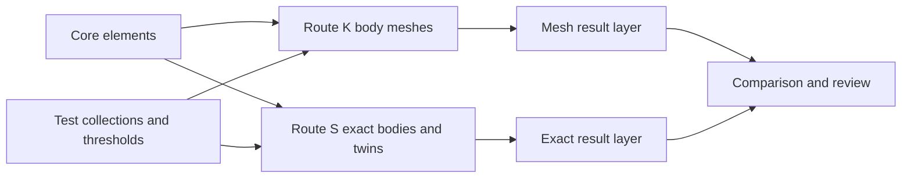
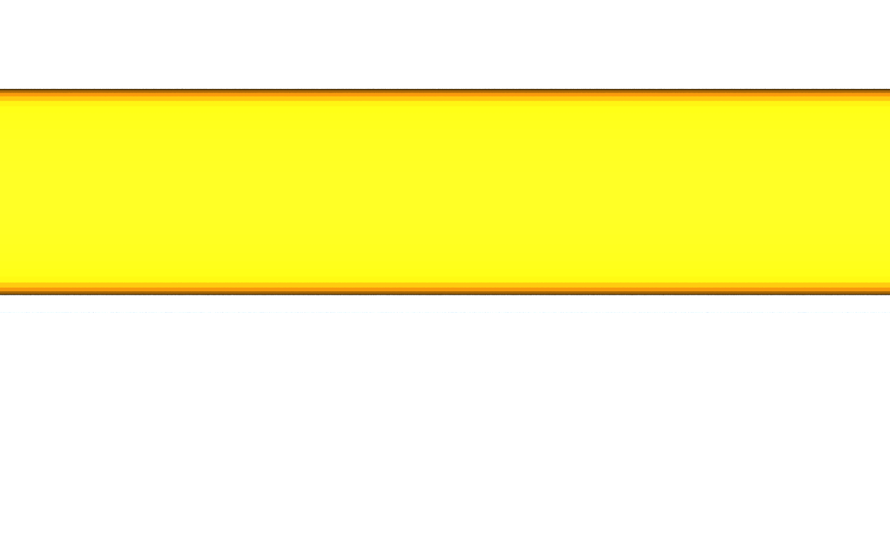
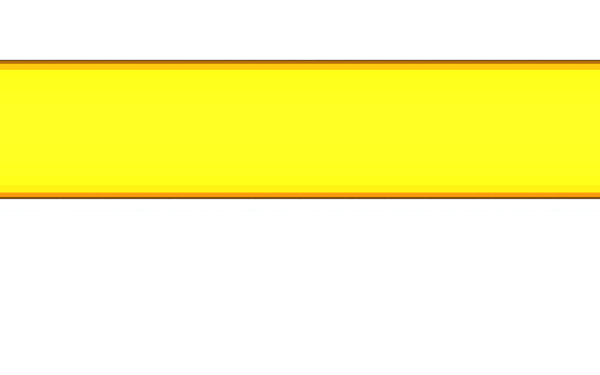
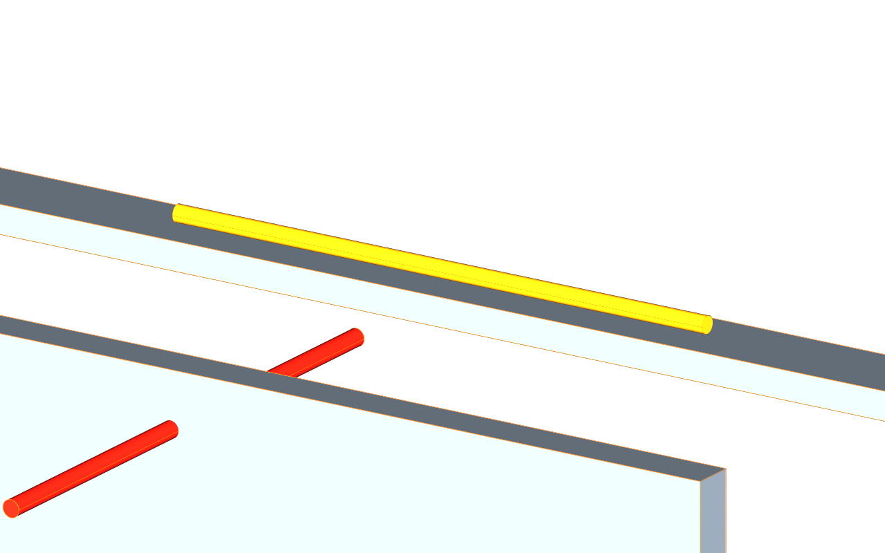

# Coordination with mesh and exact evidence

## 1 The problem

A pipe passing through an unopened partition means rework. A pipe shown close
to a tray may be separated, touching or only apparently penetrating because
of tessellation. A coordinator needs measured evidence and its uncertainty
beside the finding to decide whether another geometry route is necessary.

## 2 The data as it arrives

Route K supplies triangle bodies beneath core elements. The pinned clash
fixture declares deflections for the near and tangent pipes and carries
geometric witnesses in its manifest. Unstamped planar and circular bodies use
qualified geometric estimates. Collections select `AecoElementAPI` prims.

Route S supplies `BrepArray BodyExact`, marked `role = body`, `approx = exact`,
with source identity, producer stamp and positive kernel tolerance. This
example regenerates five selected bodies through `aeco-ifc-exact` using the
pinned data generator in writable local scratch space. It follows the solid
library's representation contract and retains exact Mesh twins and edge guides.
When both original meshes and exact twins exist, the mesh route selects the
originals; a stage containing only exact twins can still run mesh checks.

## 3 The model in USD

| Record | Drivers | Derived properties |
|---|---|---|
| `AecoClashTest` | method, tolerance, clearance; setA / setB | — |
| `AecoClashResult` | status | elements, kind, distance, volume, point, uncertainty, evidence |

Properties use `aeco:clash:`. Finding kinds never classify products. Element
identity stays in core. Both records fall back to `Scope` in stock USD.
Result paths contain a deterministic UUID from the test and two element ids;
exact leaves add `Exact` to the mesh leaf name so both remain visible beneath
the same test. No extra identity property is introduced.

The inherited `AecoClashTest : AecoGroupBase` contract remains an explicit
E1/E5 exception for coordination records. It is not a new built-system or zone
kind. No new applied API is needed. Geometry uses USD and UsdSolid namespaces;
all results, studies and presentation opinions are written in separate layers.

## 4 Workflow

1. Author the collections, clearance and tolerance. Use metres, Z-up and
   distinct stable core identities for selected elements.
2. Run `aeco-clash run stage.usda --test /Clash/Pinned --method mesh --output mesh.usda --json mesh.json`.
3. Compose exported exact bodies, then run the same command with `--method exact`,
   `--output exact.usda` and `--json exact.json`.
4. Run `aeco-clash compare mesh.json --exact exact.json`. The table joins
   unordered element pairs, shows distance, volume, uncertainty and verdict
   for each route, and identifies which route decides the pair.
5. Compose the outputs and author review status in a stronger review overlay.
   Re-derive bodies after driver changes and replace each previous result layer.

Use `env -u PYTHONPATH python tools/run_clash.py` in place of `aeco-clash` from
source. The [README](../README.md) lists the complete environment and commands.

Mesh uses AABB separation, triangle intersection and surface distance, with
interior sampling to estimate penetration. It rejects unsupported topology.
Exact builds valid closed OCCT solids in world coordinates and computes common
volume and separation. One Brep per BodyExact is supported. Unsupported affine
transforms and missing/invalid exact evidence fail loudly. For multiple body
prims, exact reports the greatest common-volume body pair, otherwise the
nearest pair; its volume belongs to the named bodies, not an aggregate union.

## 5 Validation

| Rule | Severity | Seeded defect |
|---|---|---|
| ClashResultWithoutElements | error | Missing, dangling or wrong-cardinality targets |
| ClashUncertaintyExceedsTolerance | warn | Invalid band or band greater than test tolerance |
| ClashStatusUnreviewed | warn | New or unknown review status |
| ClashRouteDisagreement | warn | Different route findings with disjoint distance bands |

Each rule is registered through the Python UsdValidation plugin and has a
seeded-defect test. The cross-route rule compares results for the same test
and unordered element pair. Two hard results do not disagree merely because
mesh penetration and exact separation have different meanings. Differences
inside the combined bands are expected and do not raise this warning.

The gate loads all eight core and four clash rules. Six new results retain six
review warnings; the near and tangent mesh results retain uncertainty warnings.
The source has two classification warnings. There are no validation errors.
The hook serializes prim sites itself for compatibility with the family Python;
the shared harness otherwise owns composition, findings comparison and rendering.

## 6 The example on the demo data centre

The pinned source is demo-datacentre-01, clash v0.4.8. Counts come from
`dc.manifest.json`: 2,980 elements, 3,015 meshes, 6,244 ports, 35 spaces and two
levels. The hook also checks the actual element and mesh census. It asserts
all three cases' axes, radii, tessellation side counts, distances, uncertainty
bands and manifest witnesses. A witness is checked geometrically: extrema may
have multiple valid locations, and the mesh engine uses a gap midpoint.

There are three mesh results (two nominal hard, one nominal clearance) and
three exact results (hard, clearance, touching), with zero unclassified results.
See the measured comparison in §7 and [expected findings](../examples/datacentre/expected/findings.json).

The close-ups tessellate the same exact pipe/tray bodies at 0.1 mm and 6 mm
requested linear deflections, with a 0.5 radian angular limit. Pipe triangle
counts are 228 and 124; the tray has 12 in each. Measured gaps are 5.030531 mm
and 5.030654 mm. Angular limits and the retained extremum make these gaps
similar despite different triangle counts. These are separate linked proxy
studies under the original referents, translated only for their cameras.

The flattened crate includes source, exact bodies, twins, results and studies.
Own layers are archived separately, including the wireframe-view overlay.
A relocated copy composes and renders without family plugins.

## 7 Trade-offs and alternatives

The table is generated by the CLI and checked byte-for-byte against its
[expected counterpart](../examples/datacentre/expected/compare.md).

pair | mesh distance (m) | mesh volume (m³) | mesh uncertainty (m) | mesh verdict | exact distance (m) | exact volume (m³) | exact uncertainty (m) | exact verdict | decided by
--- | ---: | ---: | ---: | --- | ---: | ---: | ---: | --- | ---
through-wall | -0.075000003 | — | 0.0002201 | hard | -0 | 0.000428366761 | 2e-05 | hard | both
over-tray | 0.00500011444 | — | 0.0057582 | undecidable (clearance) | 0.005 | 0 | 2e-05 | clearance | exact
tangent | -0.00106354058 | — | 0.0010636 | undecidable (hard) | 0 | 0 | 2e-05 | touching | exact

Exact overlap distance is negative zero: common volume decides hard clashes; the bridge does not calculate penetration depth. Mesh volume is not measured.

The 5 mm case is decided only by exact. The mesh reports nominal clearance,
but its 5.7582 mm band includes contact. The tangent's false penetration also
lies inside its mesh band. Exact uncertainty is 0.020 mm for each pair, the sum
of the two exported kernel tolerances. Exact touching is resolved against the
test's 1 mm touching tolerance; this does not prove a mathematical zero gap.

A body's `aeco:body:tolerance` takes precedence when authored. The current
exporter writes the canonical core `aeco:derived:tolerance`, which is used
otherwise; exact requires a positive finite value. Mesh may additionally read
a converter stamp or estimate circular-ring sagitta and planar facets, with
those assumptions retained in evidence. Pair bands add. Zero mesh uncertainty
is never inferred for an arbitrary unstamped curved surface.

The bridge's BRepExtrema distance is unsigned separation and returns zero for
intersecting solids. Exact overlap is represented by negative zero plus common
volume, not an invented penetration depth. Hard means common volume exceeds
the cube of the combined kernel tolerance; the user clearance threshold does
not suppress positive-volume overlap. Its point is explicitly a camera-framing
midpoint because the bridge does not expose extrema witnesses.

The NumPy mesh route needs no exact runtime. Exact adds a native dependency
and process boundary but resolves the two ambiguous fixture cases. An absent
runtime or missing exact JSON is explicitly NOT RUN; an evaluated pair outside
the reporting range is instead labelled not reported. AABB-only checks and
mesh density cannot substitute for exact evidence.

## 8 Out of scope and open questions

Certified penetration depth, aggregated multi-body intersection volume,
multiple Breps inside one BodyExact, nonuniform transforms, animated geometry,
BCF export, exact driver evaluation and whole-facility acceleration remain
outside this release. No whole-facility performance claim is made.

## 9 Status

Version 0.2.4 delivers both engines, four validators, the measured comparison,
two exact tessellation studies, Route S wireframe and portable results.
The [acceptance report](acceptance.md) records the gate and remaining limits.
