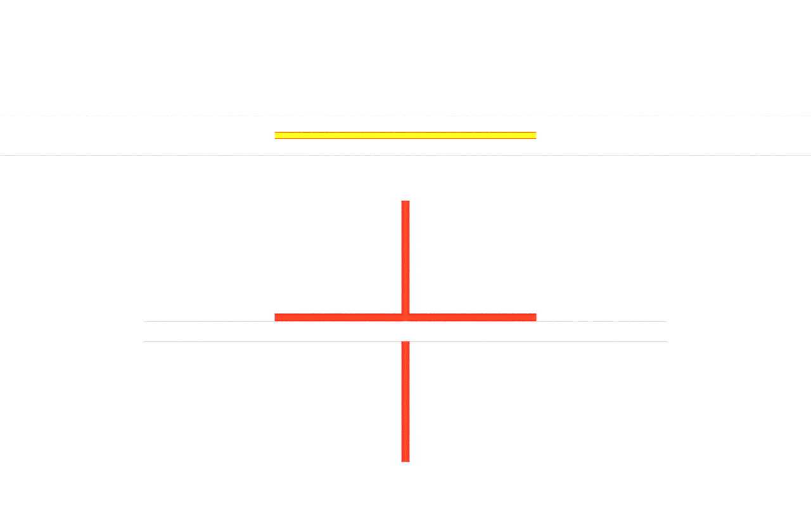

# usdAecoClash

`AecoClashTest` owns standard `setA`, `setB` and inherited `members` collections.
`AecoClashResult` records each measured pair beneath that test. Both have stock
`Scope` fallbacks. Elements keep their identity and spatial placement.

Open the [minimal mesh example](../examples/minimal.usda), then follow the
[pinned comparison](../../examples/datacentre/README.md). The
[walkthrough](../../docs/usecase.md) explains both routes and their limits.

Mesh distances are positive gaps or negative sampled penetration estimates.
Exact computes common volume and separation using OCCT. Overlap has negative
zero distance and positive volume; the bridge does not expose penetration depth.
The JSON evidence names both bodies' role, approximation, stamp and tolerance.
Exact twins never replace the original Route K mesh for comparison.

The table identifies undecidable mesh findings and the route that resolves each
pair. On the pinned fixture, exact alone decides the 5 mm clearance and tangent.
Measurements are derived; review status is a driver authored in its own layer.
